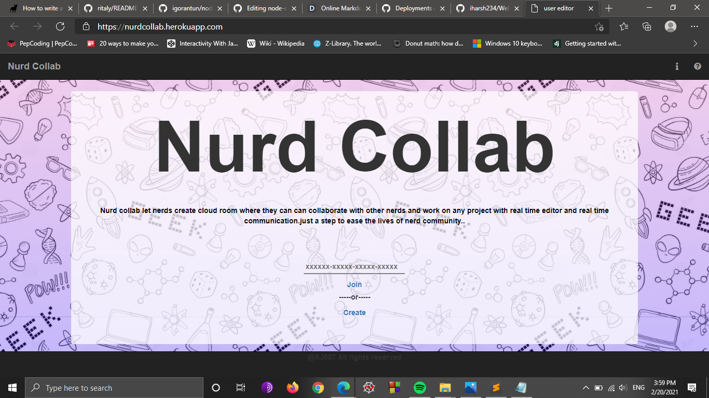

# Nurd Collab
 [](https://github.com/AJOO7/nurdcollab/stargazers) [](https://github.com/AJOO7/nurdcollab/issues)  [](https://nurdcollab.herokuapp.com) 

Nurd collab lets nerds create cloud room where they can can collaborate with other nerds and work on any project with real time editor and real time communication.just a step to ease the lives of nerd community..
 
 ## Table of contents
* [General info](#general-info)
* [Screenshots](#screenshots)
* [Technologies](#technologies)
* [Setup](#setup)
* [Features](#features)
* [Status](#status)
* [Inspiration](#inspiration)
* [Contact](#contact)



Dillinger is a cloud-enabled, mobile-ready, offline-storage compatible,
AngularJS-powered HTML5 Markdown editor.

- Type some Markdown on the left
- See HTML in the right
- ✨Magic ✨

## Features

- Peer coding 
- Multiple language syntax support
- Multiple Background themes
- Realtime collaboration
- Upload/Download source code
- Text reader

## Technologies
* Socket.io - version 1.0
* Web RTC - version 2.0
* Peerjs - version 3.0

## Installation

As [John Gruber] writes on the [Markdown site][df1]
nstall the dependencies and devDependencies and start the server.

```sh
cd dillinger
npm i
node app
```

> The overriding design goal for Markdown's
> formatting syntax is to make it as readable
> as possible. The idea is that a
> Markdown-formatted document should be
> publishable as-is, as plain text, without
> looking like it's been marked up with tags
> or formatting instructions.

This text you see here is *actually- written in Markdown! To get a feel
for Markdown's syntax, type some text into the left window and
watch the results in the right.

## Tech

Dillinger uses a number of open source projects to work properly:

- [AngularJS] - HTML enhanced for web apps!
- [Ace Editor] - awesome web-based text editor
- [markdown-it] - Markdown parser done right. Fast and easy to extend.
- [Twitter Bootstrap] - great UI boilerplate for modern web apps
- [node.js] - evented I/O for the backend
- [Express] - fast node.js network app framework [@tjholowaychuk]
- [Gulp] - the streaming build system
- [Breakdance](https://breakdance.github.io/breakdance/) - HTML
to Markdown converter
- [jQuery] - duh

And of course Dillinger itself is open source with a [public repository][dill]
 on GitHub.

## Development

Want to contribute? Great!

Dillinger uses Gulp + Webpack for fast developing.
Make a change in your file and instantaneously see your updates!


