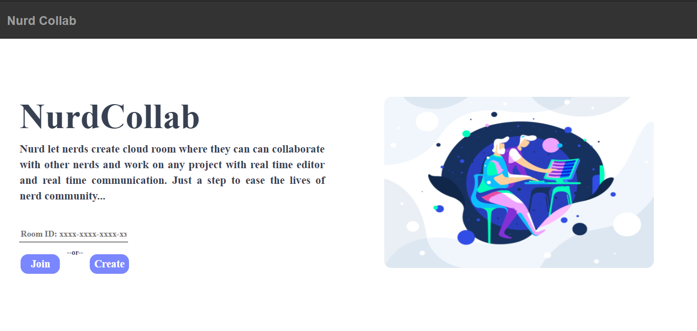
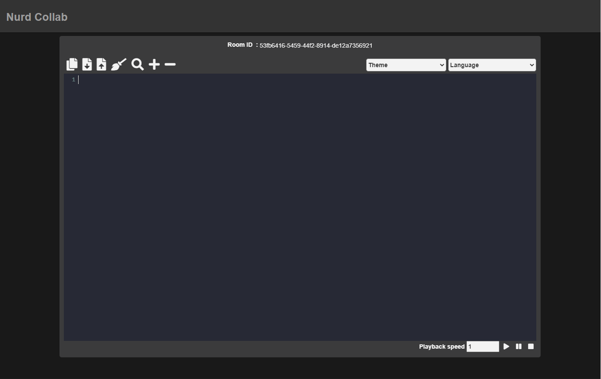
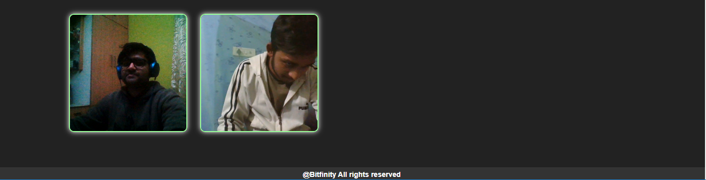

# NurdCollab

[](https://github.com/AJOO7/nurdcollab/stargazers) [](https://github.com/AJOO7/nurdcollab/issues) [](https://nurdcollab.herokuapp.com)

NurdCollab lets nerds create cloud room where they can can collaborate with other nerds and work on any project with real time editor and real time communication.

## Table of contents

- [General info](#general-info)
- [Website](#website)
  - [Home Page](#home-page)
  - [Editor Page](#editor-page)
- [Features](#features)
- [Technologies](#technologies)
- [Installation](#installation)

## General info

NurdCollab is an online platform that provides online text editor supporting real time collaboration among multiple users. It supports various editor background themes and programming language syntax. Real time communication (audio as well as video) along with other features takes peer programming to a different level.

## Website

### Home Page




### Editor Page

Code Editor


Video chat


## Features

- Code collaboration at real time
- Support for multiple programming language syntax
- Support for multiple editor background themes
- Realtime communication via audio and video chat
- Upload/Download source code
- Text reader for reading content of editor
- Supports multiple users (tested upto 10 users)

## Technologies

- Nodejs - version 0.6.1
- Express - version 4.17.1
- Ejs - version 3.1.5
- Socket.io - version 2.0.0
- Peerjs - version 0.6.1
- Uuid - version 8.3.2
- Code Mirror - version 5.59.1

## Installation

Install [node.js](https://nodejs.org/en/download/) on the system
Run Node.js command prompt

```sh
cd nurdcollab
npm install
npm start / node index.js
```
